# GetLostInPeru
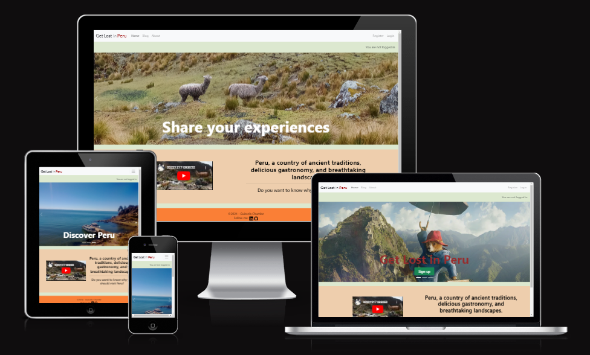
## Introduction

Get Lost in Peru is a blog webpage where a site user can view information about the most essential tips and recommendations if you are planning to visit Peru. The webpage aims to share experiences through posts. Registered users will also be able to interact with the website by adding comments to posts. And if they are interested in a post, they can add a like to it.

GetLostInPeru has been developed as part of the Code Institute's Full-Stack Developer course, focusing on Django and Bootstrap frameworks, database manipulation, and CRUD functionality. It is for educational purposes only.

View live site here : [GetLostInPeru](https://project-get-lost-in-peru-becd606e7388.herokuapp.com/)  
  
For Admin access with relevant sign-in information: [GetLostInPeru Admin](https://project-get-lost-in-peru-becd606e7388.herokuapp.com/admin/)

<hr>

## Table of Contents

- [GetLostInPeru](#getlostinperu)
  - [Introduction](#introduction)
  - [Table of Contents](#table-of-contents)
  - [Overview](#overview)
- [UX - User Experience](#ux---user-experience)
  - [Design Inspiration](#design-inspiration)
    - [Colour Scheme](#colour-scheme)
    - [Font](#font)
- [Project Planning](#project-planning)
  - [Strategy Plane](#strategy-plane)
    - [Site Goals](#site-goals)
  - [Agile Methodologies - Project Management](#agile-methodologies---project-management)
    - [MoSCoW Prioritization](#moscow-prioritization)
    - [Sprints](#sprints)
  - [User Stories](#user-stories)
    - [Site User Stories](#site-user-stories)
    - [Epic - Blog](#epic---blog)
  - [Scope Plane](#scope-plane)
    - [Security](#security)
  - [Structural Plane](#structural-plane)
  - [Skeleton \& Surface Planes](#skeleton--surface-planes)
    - [Wireframes](#wireframes)
    - [Database Schema - Entity Relationship Diagram](#database-schema---entity-relationship-diagram)
    - [Security](#security)
- [Features](#features)
  - [User View - Registered/Unregistered](#user-view---registeredunregistered)
  - [CRUD Functionality](#crud-functionality)
  - [Feature Showcase](#feature-showcase)
  - [Future Features](#future-features)
- [Technologies \& Languages Used](#technologies--languages-used)
  - [Libraries \& Frameworks](#libraries--frameworks)
  - [Tools \& Programs](#tools--programs)
- [Testing](#testing)
- [Deployment](#deployment)
  - [Connecting to GitHub](#connecting-to-github)
  - [Django Project Setup](#django-project-setup)
  - [Cloudinary API](#cloudinary-api)
  - [Elephant SQL](#elephant-sql)
  - [Heroku deployment](#heroku-deployment)
  - [Clone project](#clone-project)
  - [Fork Project](#fork-project)
- [Credits](#credits)
  - [Code](#code)
  - [Media](#media)
    - [Additional reading/tutorials/books/blogs](#additional-readingtutorialsbooksblogs)
  - [Acknowledgements](#acknowledgements)
 
## Overview
GetLostInPeru is a blog webpage that encourages visits to Peru. Users are invited to:

- Join the GetLostInPeru blog.
- Add and interact with posts.
- Manage their posts.
- Discover more about Peru country.
- Get relevant information about tourist places.
  
Get Lost in Peru is accessible via all browsers and is fully responsive to different screen sizes. It aims to share experiences and recommendations in Peru. 
As a user, you can access all published posts, with their comments and the number of likes each post has.
As a registered user, you can share your experiences, questions, doubts, and tips. Also, if you think a post is captivating you will be able to like it.


# UX - User Experience

## Design Inspiration

The key to carrying out a project is the passion for the subject you are going to do. In this case, I combine my interest in travelling with my love for my country, Peru. 

### Colour Scheme

The colour scheme and logo drove the design of the website. I wanted to create a clear webpage for that reason I selected pastel colors because I want the images and the content to be the protagonist. My colour scheme passed a color Blind Safe check via [Adobe Color](https://color.adobe.com/create/color-wheel). 


  
*Colour Scheme for GetLostInPeru website*

  
*Accessibility check for colour scheme*

### Font

I'm using [Google Fonts](https://fonts.google.com/), I selected 'Roboto' and 'Lato' fonts to my webpage.

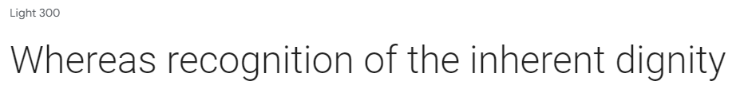 
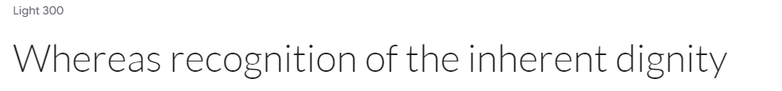 

# Project Planning  
 
## Strategy Plane

The project goal was to build an uncomplicated blog app to promote visits to Peru and at the same time provide information regarding places that could be visited.
Along the way, I thought it would be more interactive if users could add posts with essential content, which the site administrator should validate. 

### Site Goals

- A friendly UI for easy navigation.
- UX is the same whether on desktop, tablet and mobile.
- If in the future you want to add new features, that is possible because the project is ready to expand.

## Agile Methodologies - Project Management

GetLostInPeru is a project that follow the Agile planning methods.  I used my [Github Projects Board](https://github.com/users/guisselacp/projects/4) to plan and document the project.

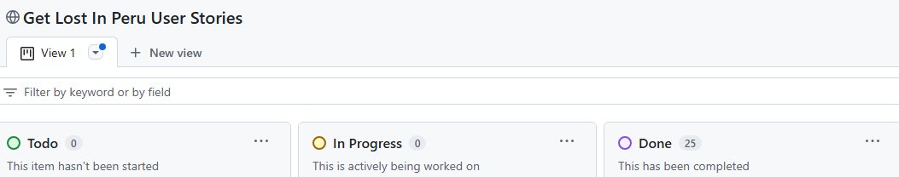 

### MoSCoW Prioritization

I used the MoSCoW Prioritization method for GetLostInPeru, with this three label types:

- **Must Have**: the 'required', components for this project. This allows me to define the "essential" to achieve the MVP (minimum viable product).
- **Should Have**: the components that are valuable to the project but not is indispensable at the MVP stage. The 'Must Haves' must receive priority over the 'Should Haves'.
- **Could Have**: features that could be implemented but are not urgent.

### Sprints

Although the project duration was reasonable, it was a challenge to achieve it because, although I was clear about what I wanted to do, it was the first time I was programming with Django and Python.
I focused on achieving the functionality of the project, and then I dedicated time to the style and colors, which is also important.

## User Stories

User stories and features on [GitHub Projects](<https://github.com/users/guisselacp/projects/4>)


### Site User Stories

| User Story | Priority |
|----------------------------------------------------------------------------------------------------------------------------|---------------|
| As a **site user**, I can **find the website navigation area** so that **I may easily navigate around the website.** | **MUST HAVE** |
| As a **site user**, I can **click on the About** so that **I can read and understand about the site** | **MUST HAVE** |
| As a **site user**, I can **see a message when I have successfully/unsuccessfully completed an action** so that **I can receive feedback from my interaction with the website.** | **MUST HAVE** |
| As a **site user**, I can **fill out a form** so that **I can contact the site owner.** | **COULD HAVE** |
| As a **site user** I can **enter my username and password** so that **I can register an account with the website.** | **MUST HAVE** |


### Epic - Blog

| User Story | Priority |
|----------------------------------------------------------------------------------------------------------------------------|---------------|
| As a **registered user**, I can **create a post** so that **I can get feedback from other users.** | **MUST HAVE** |
| As a **site user/admin**, I can **view comments on an individual post** so that **I can read the conversation.** | **MUST HAVE** |
| As a **site user**, I can **modify or delete my comment on a post** so that **I can be involved in the conversation.** | **SHOULD HAVE** |
| As a **site user**, I can **view a paginated list of posts** so that **I can select which post I want to view.** | **MUST HAVE** |
| As a **site user**, I can **click on a post** so that **I can read the full text.** | **MUST HAVE** |
| As a **registered user** I can **edit and delete my posts** so that **I can manage my own content on the site.** | **MUST HAVE** |
| As a **registered user** I can **view a post's likes** so that **I can identify the most captivating posts.**| **COULD HAVE** |
| As a **registered user** I can **click a button icon** so that **I can like posts or remove the like if I change my mind.** | **COULD HAVE** |
|As a **registered user**, I can **see the option My_Posts in the navbar** so that **I can see my own added posts.** | **COULD HAVE** |

  
## Scope Plane

The project duration was key to defining the MVP. Therefore, from the beginning, I considered creating a blog in which a user would have the option to add their own posts. Later, I decided to implement likes in the posts, which I find very attractive and give relevance to the content of a post.
My experience with Django is essential, but the course's formulation taught me how to build a web page project.

Essential features of my project were:

- An accessible website that provides relevant information to users.
- Responsive website for use on different electronic devices (mobile, tablet and desktop)
- User authentication.
- Full CRUD functionality for posts and comments.


## Structural Plane

A favicon of the Peruvian flag was added which fit with the theme of the website.

 

Standardise the size of images when displaying the post list. This makes it look more orderly.

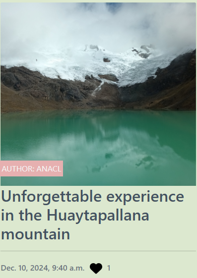 

 
## Skeleton & Surface Planes

### Wireframes

The wireframes for GetLostInPeru were created in Figma [Figma](www.figma.com).
Although it was the first time I used Figma, it was not so laborious and a good result was achieved.

**Desktop/Mobile view for:**  

- Home

From the beginning, I thought about using images on the homepage to motivate the user to enter. Using the carousel with Bootstrap seemed like a good idea, and I applied it.

<details open>
    <summary>Desktop/Mobile Home Page Wireframe - Visible to Unregistered Users</summary>  
    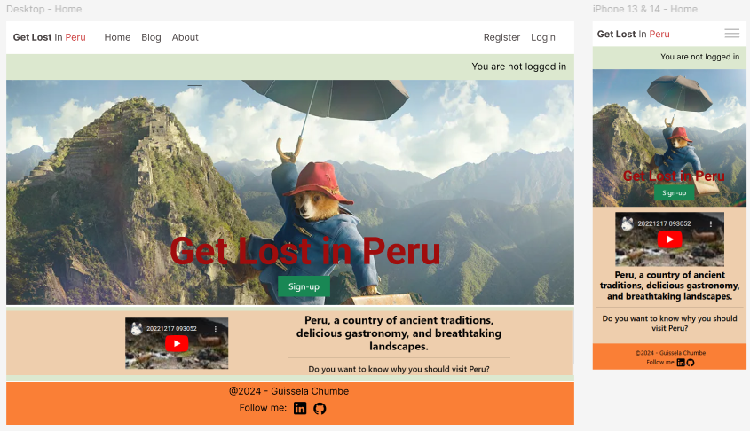  
</details>

In the Home page section, when the user is not registered, they will see 'Register' in the navbar,  which will bring them to the Sign Up page.


**Desktop view for:**

- Home Carousel

<details open>
    <summary>Desktop Wireframe Carousel image1- Visible to Unregistered Users</summary>  
    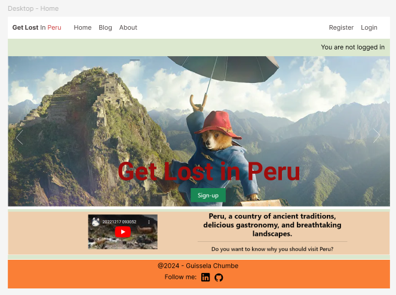  
</details>

<details open>
    <summary>Desktop Wireframe Carousel image2- Visible to Unregistered Users</summary>  
      
</details>

<details open>
    <summary>Desktop Wireframe Carousel image3</summary>  
    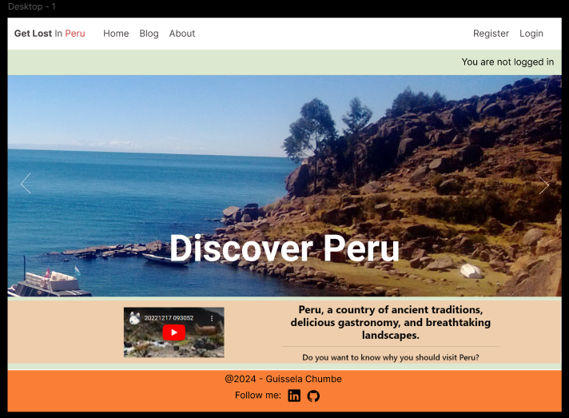  
</details>

I decided to use a carousel on the home page because it is an interesting way to attract the web user's attention. Also, if the user is not registered yet, the first slide of the carousel includes a Sign-up button to persuade the user to register.

- About

<details open>
    <summary>Desktop Wireframe About</summary>  
    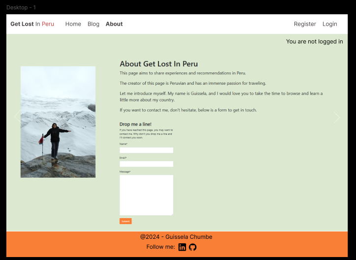  
</details>

This page presents the purpose of this page and introduces the creator of it. It also includes a form where the user can contact the site owner.

- Register

<details open>
    <summary>Desktop Wireframe Register/Sign-up</summary>  
    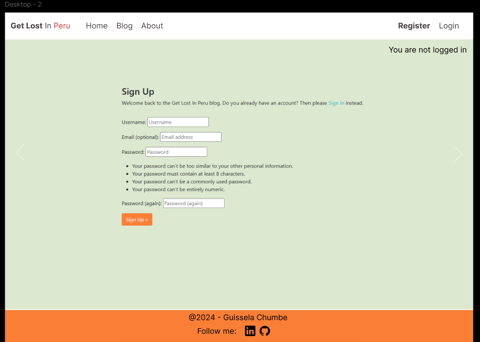  
</details>

The option "Register" invites the user to sign-up for the website and interact more dynamically.

### Database Schema - Entity Relationship Diagram
 
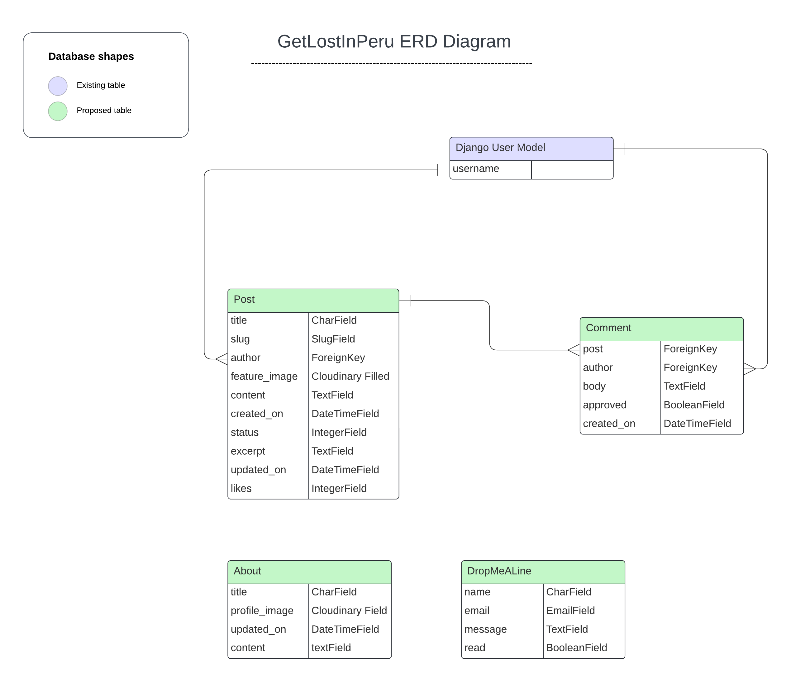  
*Database Schema (ERD) for GetLostInPeru displaying relationships between feature components saved within the database*

This Entity Relationship Diagram(ERD) demonstrates how each feature interacts with each other and the connected PostgreSQL Database. I used [Lucid Chart](www.lucidchart.com/) to create my ERD.

The Post and Comments Models of the blog walkthrough by the Code Institute were the basis for developing the project. Although there were doubts about wanting to implement new functionalities, these were overcome thanks to the dedication to completing the project and the relevant guidance of the tutors in difficult moments.

### Security

I used the following implementations:

- AllAuth
- CSFR Token

**AllAuth**  

Supports multiple authentication schemes (e.g. login by user name, or by email), as well as multiple strategies for account verification (ranging from none to mandatory email verification).

Django AllAuth is an installable framework that takes care of the user registration and authentication process. Authentication was needed to determine when a user was registered or unregistered and it controlled what content was accessible on my webpage.

. The setup of AllAuth included:

- installing it to my workspace dependencies
- adding it to my INSTALLED_APPS in my settings.py
- sourcing the AUTHENTICATION_BACKENDS from the AllAuth docs for my settings.py
- adding its URL to my projects 'urls.py'
- run database migrations to create the tables needed for AllAuth
  
**Defensive Design**  

GetLostInPeru was developed to ensure user-helpful content that motivates users to interact, so the following points were considered:

- Any user can see posts, comments, and likes.
- The authentication process is a filter in which only registered users can add posts (with prior approval from the administrator)
- Authentication processes control the edit/delete buttons to reveal them only to the author of the content.
- To delete a post, the registered user has a double checking to confirm the decision.
- Testing and validation of features completes the process.

**CSRF Tokens** 

CSRF (Cross-Site Request Forgery) tokens are included in every form to help authenticate the request with the server when the form is submitted. Absence of these tokens can leave a site vulnerable to attackers who may steal a users data.

CSRF tokens have been included in the project to prevent vulnerabilities to malicious attacks and ensure that only forms from trusted domains can be used to POST data back into the database.

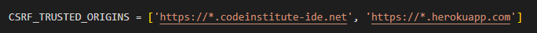 

# Features

## User View - Registered/Unregistered

GetLostInPeru was created with the idea of ​​encouraging visits to Peru, so it was considered that any user could access information on the website. However, a registered user has functionalities to interact more dynamically; here are some differences:

| Feature   | Unregistered User | Registered, Logged-In User |
|-----------|-------------------|-----------------|
| Home Page | Visible           | Visible         |
| Blog |Visible but not interactable via 'Likes/Comments', 'Add Post' button not visible   | Visable   |
| About     | Visable | Visable |


## CRUD Functionality

Users are able to Create, Read, Update and Delete their shared information on GetLostInPeru. Some features make full CRUD functionality available, whilst others present the necessary options only. Here is my CRUD breakdown for the project:

| Feature | Create | Read | Update | Delete |
|---------|--------|------|--------|--------|
| Likes | Yes | Yes | Yes | Yes |
| Posts | Yes | Yes | Yes | Yes |


## Feature Showcase 
  
**Header/Navigation & Footer**

<details open>
    <summary>Header & Navigation - Unregistered users (Navbar Option - Register)</summary>  
    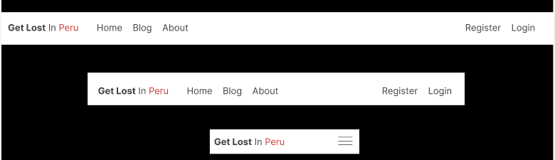  
</details>

<details open>
    <summary>Header & Navigation - Registered users (Navbar Option - My_Posts)</summary>  
    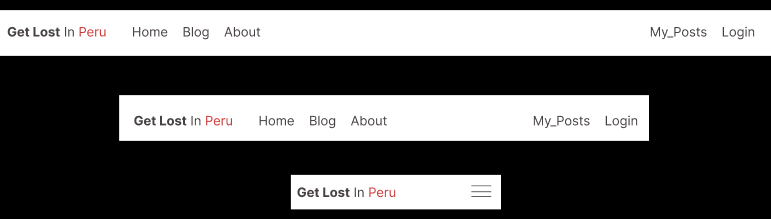  
</details>

The option "My_Posts" allows registered users to see their created posts that the administrator accepted to be published.

<details open>
    <summary>Footer - Visible to all Users</summary>  
      
</details>

In the footer, the developer's name, LinkedIn and GitHub accounts are considered.


**Home Page**

<details open>
    <summary>Home Page - Visible to Unregistered Users</summary>  
      
</details>

<details open>
    <summary>Home Page - Visible to Registered Users</summary>  
    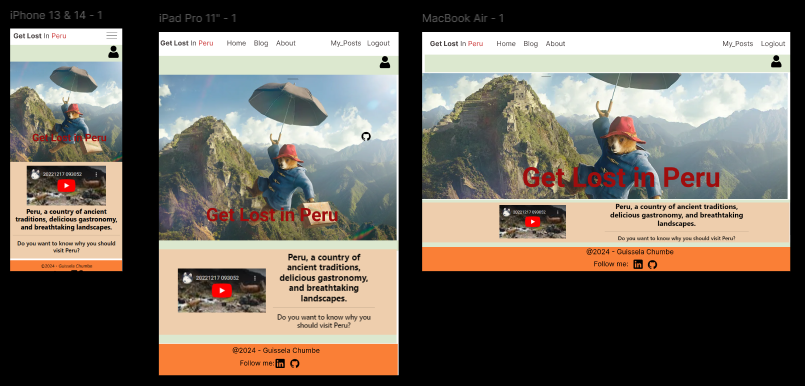  
</details>

When the registered user logs in, the options on the right-hand navigation bar will change, and they can see  'My_Posts' and 'Logout' options.
Also, a user icon will appear on the right-hand side, followed by the user's username.

**Login**

<details open>
    <summary>Sign In </summary>  
    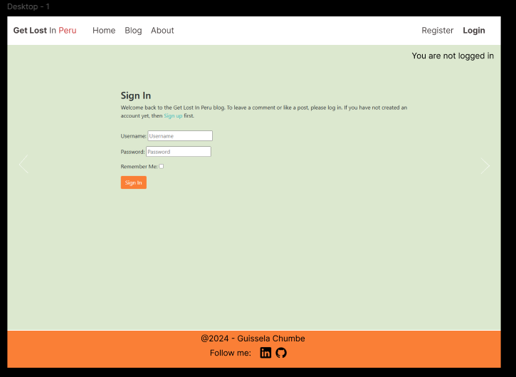  
</details>

If you are already a registered user you can access the website.
<hr>

**Logout**

<details open>
    <summary>Logout</summary>  
    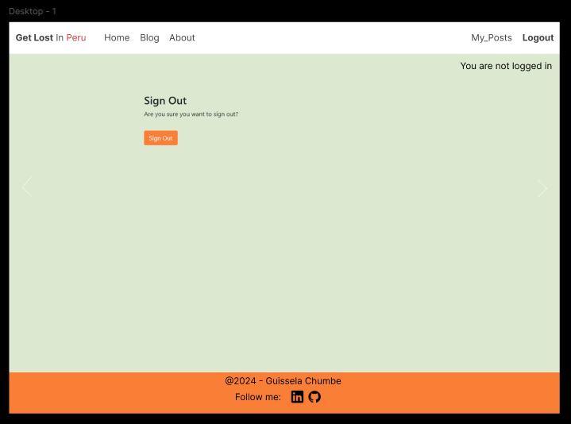  
</details>

A message is displayed to confirm the user's decision.
<hr>

**Blog**

<details open>
    <summary>Logout</summary>  
    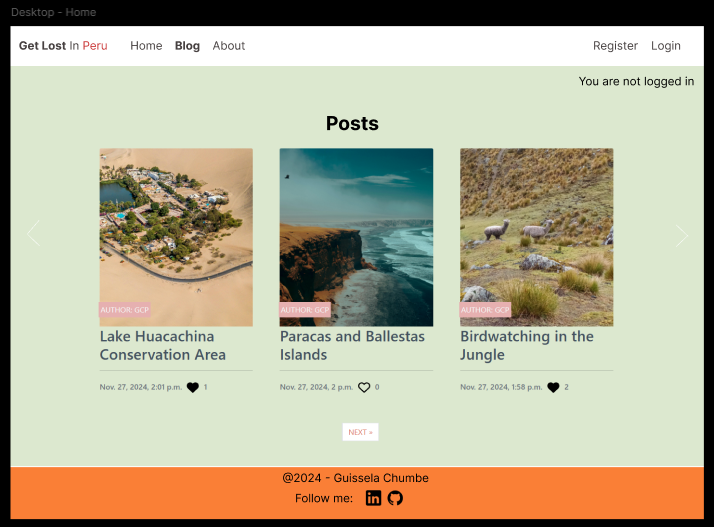  
</details>


**Create Post**

<details open>
    <summary>Logout</summary>  
      
</details>


**Edit Post**


  


**Delete Post**


**403, 404, 500 Pages**

These templates were added to this project in order to give the user the functionality to return to the website by using the links in the navigation bar or the Back to Homepage button on the Error page.


- They are triggered when a user tries to access:
  - information that is not theirs - 403,
  - information that does not exist anymore - 404,
  - something has gone wrong with the server and cannot retrieve database - 500

**Admin Panel**

Through Django's built-in Administration Panel, the Admin has full access over the data submitted to the website by registered Users. To access the Admin panel the Admin user adds '/admin/' to the end of the URL to display [https://project-get-lost-in-peru-becd606e7388.herokuapp.com/admin/](https://project-get-lost-in-peru-becd606e7388.herokuapp.com/admin). A username and password is requested. For GetLostInPeru, Admin approval is needed for posts and comments to keep the site on topic and to prevent inadequate information.

Users posts and comments require approval by the Admin of GetLostInPeru to keep the website content on topic. Admin can change the status of posts from 'Draft' to 'Published'.


## Future Features


# Technologies & Languages Used

- HTML
- CSS
- JavaScript
- Python
- [Git](https://git-scm.com/) used for version control.
- [Github](https://www.github.com) used for online storage of codebase and Projects tool.
-- [Figma](https://www.figma.com) for project design planning and wireframe creation.
- [Adobe Color](https://color.adobe.com) for colour theme creation and accessibility checkers.
- [Django](https://www.djangoproject.com/) was used as the Python framework for the site.
- [Cloudinary](https://cloudinary.com/) was used for cloud media storage of user uploaded images.
- [ElephantSQL](https://www.elephantsql.com/) was used to host the PostgreSQL database needed to collect and recall the users data.
- [Heroku](https://www.heroku.com) was used to host the FreeFido application.
- [WAVE](https://wave.webaim.org/) to evaluate the accessibility of the site.


## Libraries & Frameworks

- Bootstrap v5.2.3
- Django v4.2.16
- Django AllAuth v0.57.2
- Django Crispy Forms v2.3
- Crispy Bootstrap5 v0.7
- Django Summernote v0.8.20.0
- Python Slugify v8.0.1
- WhiteNoise 5.3.0
  

Further information is available in the [requirements.txt file](requirements.txt)

## Tools & Programs

- [Convertio](https://convertio.co/) for file conversion to PNG, WEBP.
- [Lucidchart](https://www.lucidchart.com/pages) for ERD (entity relationship diagram) creation.
- [Trello](https://www.trello.com) for intial project agile planning.
- [Favicon](https://favicon.io/) for converting an icon into favicon.

# Testing

- For all testing, please refer to the [TESTING.md](TESTING.md) file.

# Deployment
  
## Connecting to GitHub  

To begin this project from scratch, you must first create a new GitHub repository using the [Code Institute's Template](https://github.com/Code-Institute-Org/ci-full-template). This template provides the relevant tools to get you started. To use this template:

1. Log in to [GitHub](https://github.com/) or create a new account.
2. Navigate to the above CI Full Template.
3. Click '**Use this template**' -> '**Create a new repository**'.
4. Choose a new repository name and click '**Create repository from template**'.
5. In your new repository space, click the purple CodeAnywhere (if this is your IDE of choice) button to generate a new workspace.

## Django Project Setup

1. Install Django and supporting libraries: 
   
- ```pip3 install 'django<4' gunicorn```
- ```pip3 install dj_database_url psycopg2```
- ```pip3 install dj3-cloudinary-storage```  
  
2. Once you have installed any relevant dependencies or libraries, such as the ones listed above, it is important to create a **requirements.txt** file and add all installed libraries to it with the ```pip3 freeze --local > requirements.txt``` command in the terminal.  
3. Create a new Django project in the terminal ```django-admin startproject getlostinperu .```
4. Create a new app eg. ```python3 mangage.py startapp blog```
5. Add this to list of **INSTALLED_APPS** in **settings.py** - 'blog',
6. Create a superuser for the project to allow Admin access and enter credentials: ```python3 manage.py createsuperuser```
7. Migrate the changes with commands: ```python3 manage.py migrate```
8. An **env.py** file must be created to store all protected data such as the **DATABASE_URL** and **SECRET_KEY**. These may be called upon in your project's **settings.py** file along with your Database configurations. The **env.py** file must be added to your **gitignore** file so that your important, protected information is not pushed to public viewing on GitHub. For adding to **env.py**:

- ```import os```
- ```os.environ["DATABASE_URL"]="<copiedURLfromElephantSQL>"```
- ```os.environ["SECRET_KEY"]="my_super^secret@key"```
  
For adding to **settings.py**:

- ```import os```
- ```import dj_database_url```
- ```if os.path.exists("env.py"):```
- ```import env```
- ```SECRET_KEY = os.environ.get('SECRET_KEY')``` (actual key hidden within env.py)  

9. Replace **DATABASES** with:

```
DATABASES = {
    'default': dj_database_url.parse(os.environ.get("DATABASE_URL"))
  }
```

10. Set up the templates directory in **settings.py**:
- Under ``BASE_DIR`` enter ``TEMPLATES_DIR = os.path.join(BASE_DIR, ‘templates’)``
- Update ``TEMPLATES = 'DIRS': [TEMPLATES_DIR]`` with:

```
os.path.join(BASE_DIR, 'templates'),
os.path.join(BASE_DIR, 'templates', 'allauth')
```

- Create the media, static and templates directories in top level of project file in IDE workspace.

11. A **Procfile** must be created within the project repo for Heroku deployment with the following placed within it: ```web: gunicorn freefido.wsgi```
12. Make the necessary migrations again.

## Cloudinary API 

Cloudinary provides a cloud hosting solution for media storage. All users uploaded images in the FreeFid project are hosted here.

Set up a new account at [Cloudinary](https://cloudinary.com/) and add your Cloudinary API environment variable to your **env.py** and Heroku Config Vars.
In your project workspace: 

- Add Cloudinary libraries to INSTALLED_APPS in settings.py 
- In the order: 
```
   'cloudinary_storage',  
   'django.contrib.staticfiles',  
   'cloudinary',
```
- Add to **env.py** and link up with **settings.py**: ```os.environ["CLOUDINARY_URL"]="cloudinary://...."``` 
- Set Cloudinary as storage for media and static files in settings.py:
- ```STATIC_URL = '/static/'```
```
  STATICFILES_STORAGE = 'cloudinary_storage.storage.StaticHashedCloudinaryStorage'  
  STATICFILES_DIRS = [os.path.join(BASE_DIR, 'static'), ]  
  STATIC_ROOT = os.path.join(BASE_DIR, 'staticfiles')‌  
  MEDIA_URL = '/media/'  
  DEFAULT_FILE_STORAGE = 'cloudinary_storage.storage.MediaCloudinaryStorage'
```

## Elephant SQL

A new database instance can be created on [Elephant SQL](https://www.elephantsql.com/) for your project. 

- Choose a name and select the **Tiny Turtle** plan, which is free.
- Select your Region and the nearest Data Center to you. 
- From your user dashboard, retrieve the important 'postgres://....' value. Place the value within your **DATABASE_URL**  in your **env.py** file and follow the below instructions to place it in your Heroku Config Vars.


## Heroku deployment

To start the deployment process , please follow the below steps:

1. Log in to [Heroku](https://id.heroku.com/login) or create an account if you are a new user.
2. Once logged in, in the Heroku Dashboard, navigate to the '**New**' button in the top, right corner, and select '**Create New App**'.
3. Enter an app name and choose your region. Click '**Create App**'. 
4. In the Deploy tab, click on the '**Settings**', reach the '**Config Vars**' section and click on '**Reveal Config Vars**'. Here you will enter KEY:VALUE pairs for the app to run successfully. The KEY:VALUE pairs that you will need are your: 
   
   - **CLOUDINARY_URL**: **cloudinary://....** 
   - **DATABASE_URL**:**postgres://...** 
   - **DISABLE_COLLECTSTATIC** of value '1' (N.B Remove this Config Var before deployment),
   -  **PORT**:**8000**
   -  **SECRET_KEY** and value  
  
5. Add the Heroku host name into **ALLOWED_HOSTS** in your projects **settings.py file** -> ```['herokuappname', ‘localhost’, ‘8000 port url’].```
6. Once you are sure that you have set up the required files including your requirements.txt and Procfile, you have ensured that **DEBUG=False**, save your project, add the files, commit for initial deployment and push the data to GitHub.
7. Go to the '**Deploy**' tab and choose GitHub as the Deployment method.
8. Search for the repository name, select the branch that you would like to build from, and connect it via the '**Connect**' button.
9.  Choose from '**Automatic**' or '**Manual**' deployment options, I chose the 'Manual' deployment method. Click '**Deploy Branch**'.
10. Once the waiting period for the app to build has finished, click the '**View**' link to bring you to your newly deployed site. If you receive any errors, Heroku will display a reason in the app build log for you to investigate. **DISABLE_COLLECTSTATIC**  may be removed from the Config Vars once you have saved and pushed an image within your project, as can **PORT:8000**.

## Clone project

A local clone of this repository can be made on GitHub. Please follow the below steps:

1. Navigate to GitHub and log in.
2. The [GetLostPeru Repository](https://github.com/guisselacp/get-lost-peru) can be found at this location.
3. Above the repository file section, locate the '**Code**' button.
4. Click on this button and choose your clone method from HTTPS, SSH or GitHub CLI, copy the URL to your clipboard by clicking the '**Copy**' button.
5. Open your Git Bash Terminal.
6. Change the current working directory to the location you want the cloned directory to be made.
7. Type `git clone` and paste in the copied URL from step 4.
8. Press '**Enter**' for the local clone to be created.
9. Using the ``pip3 install -r requirements.txt`` command, the dependencies and libraries needed for FreeFido will be installed.
10. Set up your **env.py** file and from the above steps for Cloudinary and ElephantSQL, gather the Cloudinary API key and the Elephant SQL url for additon to your code.
11. Ensure that your **env.py** file is placed in your **.gitignore** file and follow the remaining steps in the above Django Project Setup section before pushing your code to GitHub.

## Fork Project

A copy of the original repository can be made through GitHub. Please follow the below steps to fork this repository:  

1. Navigate to GitHub and log in.  
2. Once logged in, navigate to this repository using this link [GetLostPeru Repository](https://github.com/guisselacp/get-lost-peru).
3. Above the repository file section and to the top, right of the page is the '**Fork**' button, click on this to make a fork of this repository.
4. You should now have access to a forked copy of this repository in your Github account.
5. Follow the above Django Project Steps if you wish to work on the project.

# Credits

## Code

The following blogs/tutorials complemented my learning for this project, alongside the [Code Institute's](https://codeinstitute.net/ie/) Learning Content.

- [Django Docs](https://www.djangoproject.com/)
- [Bootstrap Docs](https://getbootstrap.com/docs/5.3/getting-started/introduction/)
- [Code Institute's](https://github.com/Code-Institute-Org>) Blog/Boutique Ado walkthroughs
- [FreeFido](https://freefido.herokuapp.com/)  
- [Aperture Adventures](https://lens-whisperer-1fde92b99730.herokuapp.com//)  
- [Daisy McGirr's](https://www.youtube.com/@IonaFrisbee) easy to follow Django Recipe App tutorial for understanding how to use Django's MVT framework
- [Django UserCreationForm](https://www.javatpoint.com/django-usercreationform>) Creating New Users 
difference-between-dom-parentnode-and-parentelement-in-javascript/) of delete confirm button
- [Django Docs](https://docs.djangoproject.com/en/dev/ref/contrib/admin/#django.contrib.admin.ModelAdmin.readonly_fields) to make model item readonly for search function showing deleted articles
- [Django cleaned data how to](https://overiq.com/django-1-10/django-form-basics/?utm_content=cmp-true)

## Media

The following sites were used to gather the photographic media used in GetLostInPeru:

- [Pexels](https://www.pexels.com/)
- [Studio Canal](https://www.pexels.com/)

 Most of the photos shown on the blog are my property.


## Acknowledgements

Code Institute 

- [Amy Richardson](https://github.com/amylour) - Learning Facilitator
- [John Rearden](https://github.com/johnrearden) - Coding Coach
- [Mark Briscoe](https://github.com/mbriscoe) - Coding Coach


