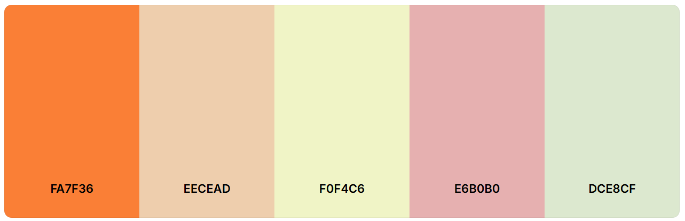
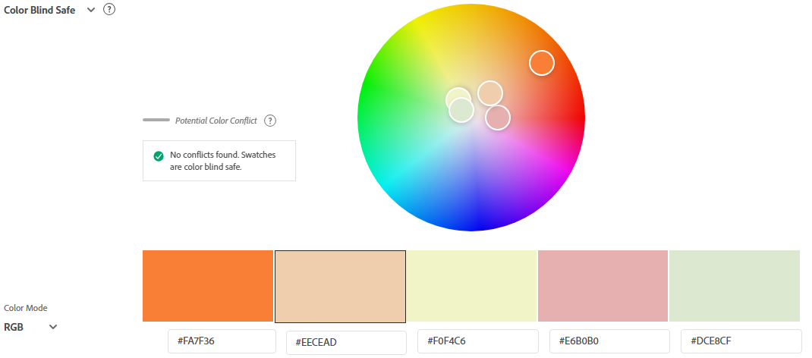

# Get Lost In Peru

## Introduction

Get Lost in Peru is a blog webpage where a site user can view information about the most essential tips and recommendations if you are planning to visit Peru. The webpage aims to share experiences through posts. Registered users will also be able to interact with the website by adding comments to posts. And if they are interested in a post, they can add a like to it.

GetLostInPeru has been developed as part of the Code Institute's Full-Stack Developer course, focusing on Django and Bootstrap frameworks, database manipulation, and CRUD functionality. It is for educational purposes only.

View live site here : [GetLostInPeru](https://project-get-lost-in-peru-becd606e7388.herokuapp.com/)  
  
For Admin access with relevant sign-in information: [GetLostInPeru Admin](https://project-get-lost-in-peru-becd606e7388.herokuapp.com/admin/)

<hr>

## Table of Contents

- [GetLostInPeru](#getlostinperu)
  - [Introduction](#introduction)
  - [Table of Contents](#table-of-contents)
  - [Overview](#overview)
- [UX - User Experience](#ux---user-experience)
  - [Design Inspiration](#design-inspiration)
    - [Colour Scheme](#colour-scheme)
    - [Font](#font)
- [Project Planning](#project-planning)
  - [Strategy Plane](#strategy-plane)
    - [Site Goals](#site-goals)
  - [Agile Methodologies - Project Management](#agile-methodologies---project-management)
    - [MoSCoW Prioritization](#moscow-prioritization)
    - [Sprints](#sprints)
  - [User Stories](#user-stories)
    - [Visitor User Stories](#visitor-user-stories)
    - [Epic - User Profile](#epic---user-profile)
    - [Epic - Articles](#epic---articles)
    - [Epic - Booking](#epic---booking)
    - [Epic - Photo Gallery](#epic---photo-gallery)
    - [Epic - Visit Us/Reviews](#epic---visit-usreviews)
  - [Scope Plane](#scope-plane)
  - [Structural Plane](#structural-plane)
  - [Skeleton \& Surface Planes](#skeleton--surface-planes)
    - [Wireframes](#wireframes)
    - [Database Schema - Entity Relationship Diagram](#database-schema---entity-relationship-diagram)
    - [Security](#security)
- [Features](#features)
  - [User View - Registered/Unregistered](#user-view---registeredunregistered)
  - [CRUD Functionality](#crud-functionality)
  - [Feature Showcase](#feature-showcase)
  - [Future Features](#future-features)
- [Technologies \& Languages Used](#technologies--languages-used)
  - [Libraries \& Frameworks](#libraries--frameworks)
  - [Tools \& Programs](#tools--programs)
- [Testing](#testing)
- [Deployment](#deployment)
  - [Connecting to GitHub](#connecting-to-github)
  - [Django Project Setup](#django-project-setup)
  - [Cloudinary API](#cloudinary-api)
  - [Elephant SQL](#elephant-sql)
  - [Heroku deployment](#heroku-deployment)
  - [Clone project](#clone-project)
  - [Fork Project](#fork-project)
- [Credits](#credits)
  - [Code](#code)
  - [Media](#media)
    - [Additional reading/tutorials/books/blogs](#additional-readingtutorialsbooksblogs)
  - [Acknowledgements](#acknowledgements)
 
## Overview
GetLostInPeru is a blog webpage that encourages visits to Peru. Users are invited to:

- Join the GetLostInPeru blog.
- Add and interact with posts.
- Manage their posts.
- Discover more about Peru country.
- Get relevant information about tourist places.
  

Get Lost in Peru is accessible via all browsers and is fully responsive to different screen sizes. It aims to share experiences and recommendations in Peru. 
As a user, you can access all published posts, with their comments and the number of likes each post has.
As a registered user, you can share your experiences, questions, doubts, and tips. Also, if you think a post is captivating you will be able to like it.


# UX - User Experience

## Design Inspiration

The key to carrying out a project is the passion for the subject you are going to do. In this case, I combine my interest in travelling with my love for my country, Peru. 

### Colour Scheme

The colour scheme and logo drove the design of the website. I wanted to create a clear webpage for that reason I selected pastel colors because I want the images and the content to be the protagonist. My colour scheme passed a color Blind Safe check via [Adobe Color](https://color.adobe.com/create/color-wheel). 


  
*Colour Scheme for GetLostInPeru website*

  
*Accessibility check for colour scheme*

### Font


  
# Project Planning  
 
## Strategy Plane

The project goal was to build an uncomplicated blog app.


### Site Goals


- Easy UI for quick fulfillment of feature CRUD functionalities
- UX remains the same whether on mobile, tablet or desktop
- Scalable idea, for addition of future features to easily grow the business

## Agile Methodologies - Project Management

GetLostInPeru is my first project following Agile planning methods. As someone who loves to prepare and plan, it was a joy to get to know and use. I used my [Github Projects Board](https://github.com/users/) to plan and document all of my work.

### MoSCoW Prioritization

I chose to follow the MoSCoW Prioritization method for GetLostInPeru, identifying and labelling my:

- **Must Haves**: the 'required', critical components of the project. Completing my 'Must Haves' helped me to reach the MVP (Minimum Viable Product) for this project early, allowing me to develop the project further than originally planned.
  
- **Should Haves**: the components that are valuable to the project but not absolutely 'vital' at the MVP stage. The 'Must Haves' must receive priority over the 'Should Haves'.
- **Could Haves**: these are the features that are a 'bonus' to the project, it would be nice to have them in this phase, but only if the most important issues have been completed first and time allows.
- **Won't Haves**: the features or components that either no longer fit the project's brief or are of very low priority for this release. 

### Sprints


My Sprints are representative of a general timeframe of focus on the stated areas, with study, project work and running a household, some sprints timeframes blended with each other as work was completed during every available free moment.


## User Stories

User stories and features recorded and managed on [GitHub Projects](<https://github.com/users/amylour/projects/4>)


### Visitor User Stories

| User Story | Priority |
|----------------------------------------------------------------------------------------------------------------------------|---------------|
| As a **user**, I would like to **view the websites home page** so that I can **learn about it and the services it offers** | **MUST HAVE** |
| As a **user**, I can **find the websites navigation area** so that I **may easily navigate around the website** | **MUST HAVE** |
| As a **user**, I can **see the sites social media links at the bottom of the webpage** so that I can **visit, contact the business and follow them online** | **MUST HAVE** |
| As a **user**, I can **view any error pages with a 'Home' button** so that I **can get back to the homepage easily** | **MUST HAVE** |
| As a **user**, I want **to see a message when I have successfully/unsuccessfully completed an action** so that I can **receive feedback from my interaction with the website** | **MUST HAVE** |

### Epic - User Profile

| User Story | Priority |
|----------------------------------------------------------------------------------------------------------------------------|---------------|    
| As a **user**, I can **use my email and password to login to my profile account** so that I can **use my profile to connect to the websites features** | **MUST HAVE** |
| As a **user**, I can **enter my email and password** so that I can **register an account with the website** | **MUST HAVE** |
| As a **user**, I can **enter my personal details** so that I can **create an account with FreeFido** | **MUST HAVE** |
| As a **user**, I can **receive feedback in the form of a logout page** so that **I can confirm that I have been logged out successfully** | **MUST HAVE** |
| As a **user**, I can **edit my user profile** to **update my personal details** | **MUST HAVE** |
| As a **user**, I can **click a delete button in my user profile setup** so that I **can delete all personal data, photos and bookings that are connected to me on the website** | **COULD HAVE** |

### Epic - Articles

| User Story | Priority |
|----------------------------------------------------------------------------------------------------------------------------|---------------|
| As an **user**, I want to be able to **create and view articles** so that I can **learn more about dog related topics** | **MUST HAVE** |
| As a **user**, I would like to **move to the next page** so that I can **view all of the articles** | **SHOULD HAVE** |
| As a **user**, I would like to **view an article's likes** so that I can **find the most interesting articles** | **COULD HAVE** |
| As a **user**, I can **visit the articles page** so that I **can read and interact with the articles** | **MUST HAVE** |
| As a **user**, I can **click on an article** so that I **can view it's contents** | **MUST HAVE** |
| As a **user**, I can **click a button icon** so that I **can like/unlike and article** | **COULD HAVE** |
| As a **user**, I can **comment on a post** so that I can **interact and get involved with the conversation** | **SHOULD HAVE** |
| As a **user**, I can **fill-in, edit and save an article text field** so that I can **create and share an article from my profile** | **MUST HAVE** |
| As a **user**, I can **click on the edit button of my article** so that I can **edit the article and save it again** | **MUST HAVE** |
| As a **user**, I can **click on the delete button on my own article page** so that I can **delete the article** | **MUST HAVE** |
| As a **user**, I can **enter a search term into the search bar** so that I can **search for particular articles and articles with information topics that I am interested in** | **SHOULD HAVE** |
| As a **user**, I can **click a delete button** so that I **can remove a comment that I have made** | **COULD HAVE** |
  
### Epic - Booking

| User Story | Priority |
|----------------------------------------------------------------------------------------------------------------------------|---------------|
| As a **user**, I can **view the booking home page** so that I can **learn about booking and see my active bookings** | **MUST HAVE** |
| As a **user**, I can **use the bookings page** so that I can **make a booking at the dog park** | **MUST HAVE** |
| As a **user**, I can **receive feedback via email when I make a booking** so that I **can confirm my booking and keep a copy of it in my email account** | **COULD HAVE** |
| As a **user**, I can **edit my confirmed bookings** so that I **can choose a different day or time slot or add an extra dog** | **MUST HAVE** |
| As a **user**, I can **click the 'Trash' icon under my booking** so that I can **delete that booking from my bookings list** | **MUST HAVE** |
| As a **user**, I can **get feedback from the website** that will **explain that only four active bookings are allowed per person** | **SHOULD HAVE** |

### Epic - Photo Gallery

| User Story | Priority |
|----------------------------------------------------------------------------------------------------------------------------|---------------|
| As a **user**, I can **visit the gallery page** so that I can **view the gallery wall of photos** | **COULD HAVE** |
| As a **user**, I can **click the upload image button on the Gallery page** so that I can **upload an image of my dog having fun in the park** | **COULD HAVE** |
| As a **user**, I can **click the 'Trash' icon when I hover/click on a photo** so that I can **delete the photo** | **COULD HAVE** |

### Epic - Visit Us/Reviews

| User Story | Priority |
|----------------------------------------------------------------------------------------------------------------------------|---------------|
| As a **user**, I can **view the 'Visit Us' page** so that I can **see the businesses location and details** | **MUST HAVE** |
| As a **user**, I can **fill out a review form** so that I can **leave feedback about my park visit** | **COULD HAVE** |
| As a **user**, I can **edit my review** so that I can **correct a mistake or change my review** | **COULD HAVE** |
| As a **user**, I can **click the delete button beside my review** so that I can **delete a review that I made** | **COULD HAVE** |
    
    
## Scope Plane

As this would be a dual learning/building project using technologies that were new to me, such as Django, SQL, Bootstrap and Cloudinary, I was cautious to maintain consistent control over the scope of the project and not let my idea grow too big. With the sheer amount of files, I needed to lockdown my project features early on into manageable blocks so as not to lose track of the MVP. Following my learning of the Django MVT framework I was able to identify how to change the templated structure to produce different website features from my base HTML. This allowed me to build upon my original idea of 'Booking app' only, and to add a social experience around articles and shared images. Following Agile Planning Methodologies, I added my Developer Tasks, User Stories and Testing Tasks as issues on my [GitHub project board](https://github.com/users/amylour/projects/4), and set up Sprints to keep the flow of the project in check.

Essential features of my project were:

- A striking, accessible website that fulfils user needs
- Responsive website for users of mobile, tablet and desktop devices
- User Authentication
- User Profile creation and editing
- Article feature with full CRUD functionality
- Booking feature with full CRUD functionality
- Gallery wall with adding/deletion of images
- Business details to inform the user

Planning my project thoroughly from the start allowed me to identify areas of importance for MVP completion and satisfaction of assessment criteria, and to balance them with the feasibility of the features.


## Structural Plane


 
  

A favicon was added of the Peru map to fit with the theme of the website.
  

  
*Map Favicon*
  

   

To allow for ease of responsiveness, each section was designed keeping in mind the switch from 'row' to 'column' when moving from Desktop to Mobile/Tablet view. This approach allowed me to add more features to the project early on by reusing and repurposing sections of code.

## Skeleton & Surface Planes

### Wireframes

The wireframes for GetLostInPeru were created in Figma and were high-spec from the beginning as I was sure of my design concept. [Figma](www.figma.com) is an easy and fast design system for web and software mockups that allows for great control and testing of ideas particularly within the specific frame sizes which represent different devices. As I was using Bootstrap, I was confident that I had created a modular structure for my feature elements that would suit a grid system and that would allow them to easily work across different devices and screen sizes.

**Mobile/Tablet view for:**  

- Home
- About


**Desktop view for:**

- Home
- Sign Up


### Database Schema - Entity Relationship Diagram

  
*Database Schema (ERD) for GetLostInPeru displaying relationships between feature components saved within the database*

This Entity Relationship Diagram(ERD) demonstrates how each feature interacts with each other and the connected PostgreSQL Database. Using Django's User Model, and Django AllAuth to carry out all user authentication, a user_id is created when the user registers with their username and email. This allows the user to edit a blank profile, create new articles, add comments and photos which will display their username, and create and manage their bookings. 

The Posts and Comments Models were inspired by the blog walkthrough by the Code Institute during my learning of Django. They helped me to get a good and secure grasp of the templating structure and connected Python files to push my features further, make them my own.

Through the Admin Django Dashboard, the connected user_id to all data entered to the site means that the Admin can remove a User and their data completely through the additon of on_delete=models.CASCADE. At the moment, a user can remove any data they share with the site, but they cannot delete their account completely. This feature will come in the next version.

### Security

A number of security steps were taken in this project in order to protect the user's submitted data. Unlike a strictly informative website, FreeFido allows the user to become part of the community and avail of it's booking services. To meet the strict internet standards of protecting a user's data, the following processes were included in the project's development.

**AllAuth**  

Django AllAuth is an installable framework that takes care of the user registration and authentication process. Authentication was needed to determine when a user was registered or unregistered and it controlled what content was accessible on FreeFido. The setup of AllAuth included:

- installing it to my workspace dependencies
- adding it to my INSTALLED_APPS in my settings.py
- sourcing the AUTHENTICATION_BACKENDS from the AllAuth docs for my settings.py
- adding its URL to my projects 'urls.py'
- run database migrations to create the tables needed for AllAuth
- (For this version of FreeFido, to meet MVP, email and social accounts were not configured as part of the feedback/sign up options to the user. They will be included with the next release.)
  
**Defensive Design**  

GetLostInPeru was developed to ensure a smooth user experience, to the best of my current learning experience with Django. 

- Input validation and error messages provide feedback to the user to guide them towards the desired outcome. 
- Unregistered users are diverted to the Sign Up page from restricted access pages. 
- Authentication processes control edit/delete icons to reveal them to the content author only. 
- Deletion of data is confirmed through an additional modal, double-checking with the user.
- Error pages are displayed with 'Take me home' buttons to help users get back on track. 
- Testing and validation of features completes the process.

**CSRF Tokens** 

CSRF (Cross-Site Request Forgery) tokens are included in every form to help authenticate the request with the server when the form is submitted. Absence of these tokens can leave a site vulnerable to attackers who may steal a users data.
  

# Features

## User View - Registered/Unregistered

It was important to me from the beginning that GetLostInPeru be accessible to an unregistered user. I wanted the website to accessible to a new user quickly by immediately inviting them into the community through the blog's information, posts and gallery sections. The following is a breakdown of the site's accessibility for registered/unregistered users:

| Feature   | Unregistered User | Registered, Logged-In User |
|-----------|-------------------|-----------------|
| Home Page | Visable           | Visable         |
| Profile   | Not Visible - 'Profile' icon only appears for registered, logged-in users | Visable and full feature interaction available |
| Blog      | Visable but not interactable via 'Likes/Comments', 'Add Post' button not visible | Visable and full feature interaction available |
|
| 
| 


## CRUD Functionality

Users are able to Create, Read, Update and Delete their shared information on FreeFido. Some features make full CRUD functionality available, whilst others present the necessary options only. Here is my CRUD breakdown for FreeFido:

| Feature | Create | Read | Update | Delete |
|---------|--------|------|--------|--------|
| Profile | Created upon registration | Yes | Yes | Full Profile deletion is currently only available to Admin upon User Account deletion, the profile dashboard clears automatically if a user removes all of their articles or bookings |
| Posts | Yes | Yes | Yes | Yes |


## Feature Showcase 
  
**Header/Navigation & Footer**


  

**Home Page**


**About Page**


<hr>

**Registration/SignUp**


**Sign In**


**Sign Out**


<hr>

**Profile**

  
  
**Profile Edit**


**Articles**


**Create Post**


**Edit Post**


  


**Delete Post**


**Gallery**


**Visit Us**


**403, 404, 500 Pages**

These templates were added to this project in order to give the user the functionality to return to the website by using the links in the navigation bar or the Back to Homepage button on the Error page.


- They are triggered when a user tries to access:
  - information that is not theirs - 403,
  - information that does not exist anymore - 404,
  - something has gone wrong with the server and cannot retrieve database - 500

**Admin Panel**

Through Django's built-in Administration Panel, the Admin has full access over the data submitted to the website by registered Users. To access the Admin panel the Admin user adds '/admin/' to the end of the URL to display [https://freefido.herokuapp.com/admin/](https://project-get-lost-in-peru-becd606e7388.herokuapp.com/admin)). A username and password is requested. For GetLostInPeru, Admin approval is needed for posts and comments to keep the site on topic and to prevent spamming. 


Users articles and comments require approval by the Admin of GetLostInPeru to keep the website content on topic. Admin can change the status of posts from 'Draft' to 'Published'.


  
<details>
    <summary>Dropdown menu allowing Admin to 'approve' a users comment, 'Go' must be clicked to confirm</summary>  
    </details>
    

## Future Features


# Technologies & Languages Used

- HTML
- CSS
- JavaScript
- Python
- [Git](https://git-scm.com/) used for version control.
- [Github](https://www.github.com) used for online storage of codebase and Projects tool.
- [CodeAnywhere](https://app.codeanywhere.com) as an online, cloud-based IDE for development.
- [Figma](https://www.figma.com) for project design planning and wireframe creation.
- [Adobe Color](https://color.adobe.com) for colour theme creation and accessibility checkers.
- [Django](https://www.djangoproject.com/) was used as the Python framework for the site.
- [Cloudinary](https://cloudinary.com/) was used for cloud media storage of user uploaded images.
- [ElephantSQL](https://www.elephantsql.com/) was used to host the PostgreSQL database needed to collect and recall the users data.
- [Heroku](https://www.heroku.com) was used to host the FreeFido application.
- [WAVE](https://wave.webaim.org/) to evaluate the accessibility of the site.
- [Procreate](https://procreate.com/) for image creation and editing.

## Libraries & Frameworks

- Bootstrap v5.2.3
- Django v3.2.19
- Django AllAuth v0.54.0
- Django Crispy Forms v2.0
- Crispy Bootstrap5 v0.7
- Django Resized v1.0.2
- Django RichTextField v1.6.1
- Django Summernote v0.8.2
- Python Slugify v8.0.1
- Pillow v9.5
  
Further information is available in the [requirements.txt file](requirements.txt)

## Tools & Programs

- [EZGif](<https://ezgif.com/>) for gif conversion.
- [Convertio](https://convertio.co/) for file conversion to PNG, WEBP.
- [Tiny Png](https://tinypng.com/) for file size reduction.
- [Lucidchart](https://www.lucidchart.com/pages) for ERD (entity relationship diagram) creation.
- [Trello](https://www.trello.com) for intial project agile planning.
- [Perplexity AI](https://www.perplexity.ai/) for breaking down Python concepts and Django documentation into more understandable chunks.
- [Pattern Monster](https://pattern.monster/) for the hero image pattern SVG.
- [Favicon](https://favicon.io/) for converting an icon into favicon.
- [LogoAI](https://www.logoai.com/) for design inspiration using my font and colour choices.

# Testing

- For all testing, please refer to the [TESTING.md](TESTING.md) file.

# Deployment
  
## Connecting to GitHub  

To begin this project from scratch, you must first create a new GitHub repository using the [Code Institute's Template](https://github.com/Code-Institute-Org/ci-full-template). This template provides the relevant tools to get you started. To use this template:

1. Log in to [GitHub](https://github.com/) or create a new account.
2. Navigate to the above CI Full Template.
3. Click '**Use this template**' -> '**Create a new repository**'.
4. Choose a new repository name and click '**Create repository from template**'.
5. In your new repository space, click the purple CodeAnywhere (if this is your IDE of choice) button to generate a new workspace.

## Django Project Setup

1. Install Django and supporting libraries: 
   
- ```pip3 install 'django<4' gunicorn```
- ```pip3 install dj_database_url psycopg2```
- ```pip3 install dj3-cloudinary-storage```  
  
2. Once you have installed any relevant dependencies or libraries, such as the ones listed above, it is important to create a **requirements.txt** file and add all installed libraries to it with the ```pip3 freeze --local > requirements.txt``` command in the terminal.  
3. Create a new Django project in the terminal ```django-admin startproject freefido .```
4. Create a new app eg. ```python3 mangage.py startapp booking```
5. Add this to list of **INSTALLED_APPS** in **settings.py** - 'booking',
6. Create a superuser for the project to allow Admin access and enter credentials: ```python3 manage.py createsuperuser```
7. Migrate the changes with commands: ```python3 manage.py migrate```
8. An **env.py** file must be created to store all protected data such as the **DATABASE_URL** and **SECRET_KEY**. These may be called upon in your project's **settings.py** file along with your Database configurations. The **env.py** file must be added to your **gitignore** file so that your important, protected information is not pushed to public viewing on GitHub. For adding to **env.py**:

- ```import os```
- ```os.environ["DATABASE_URL"]="<copiedURLfromElephantSQL>"```
- ```os.environ["SECRET_KEY"]="my_super^secret@key"```
  
For adding to **settings.py**:

- ```import os```
- ```import dj_database_url```
- ```if os.path.exists("env.py"):```
- ```import env```
- ```SECRET_KEY = os.environ.get('SECRET_KEY')``` (actual key hidden within env.py)  

9. Replace **DATABASES** with:

```
DATABASES = {
    'default': dj_database_url.parse(os.environ.get("DATABASE_URL"))
  }
```

10. Set up the templates directory in **settings.py**:
- Under ``BASE_DIR`` enter ``TEMPLATES_DIR = os.path.join(BASE_DIR, ‘templates’)``
- Update ``TEMPLATES = 'DIRS': [TEMPLATES_DIR]`` with:

```
os.path.join(BASE_DIR, 'templates'),
os.path.join(BASE_DIR, 'templates', 'allauth')
```

- Create the media, static and templates directories in top level of project file in IDE workspace.

11. A **Procfile** must be created within the project repo for Heroku deployment with the following placed within it: ```web: gunicorn freefido.wsgi```
12. Make the necessary migrations again.

## Cloudinary API 

Cloudinary provides a cloud hosting solution for media storage. All users uploaded images in the FreeFid project are hosted here.

Set up a new account at [Cloudinary](https://cloudinary.com/) and add your Cloudinary API environment variable to your **env.py** and Heroku Config Vars.
In your project workspace: 

- Add Cloudinary libraries to INSTALLED_APPS in settings.py 
- In the order: 
```
   'cloudinary_storage',  
   'django.contrib.staticfiles',  
   'cloudinary',
```
- Add to **env.py** and link up with **settings.py**: ```os.environ["CLOUDINARY_URL"]="cloudinary://...."``` 
- Set Cloudinary as storage for media and static files in settings.py:
- ```STATIC_URL = '/static/'```
```
  STATICFILES_STORAGE = 'cloudinary_storage.storage.StaticHashedCloudinaryStorage'  
  STATICFILES_DIRS = [os.path.join(BASE_DIR, 'static'), ]  
  STATIC_ROOT = os.path.join(BASE_DIR, 'staticfiles')‌  
  MEDIA_URL = '/media/'  
  DEFAULT_FILE_STORAGE = 'cloudinary_storage.storage.MediaCloudinaryStorage'
```

## Elephant SQL

A new database instance can be created on [Elephant SQL](https://www.elephantsql.com/) for your project. 

- Choose a name and select the **Tiny Turtle** plan, which is free.
- Select your Region and the nearest Data Center to you. 
- From your user dashboard, retrieve the important 'postgres://....' value. Place the value within your **DATABASE_URL**  in your **env.py** file and follow the below instructions to place it in your Heroku Config Vars.


## Heroku deployment

To start the deployment process , please follow the below steps:

1. Log in to [Heroku](https://id.heroku.com/login) or create an account if you are a new user.
2. Once logged in, in the Heroku Dashboard, navigate to the '**New**' button in the top, right corner, and select '**Create New App**'.
3. Enter an app name and choose your region. Click '**Create App**'. 
4. In the Deploy tab, click on the '**Settings**', reach the '**Config Vars**' section and click on '**Reveal Config Vars**'. Here you will enter KEY:VALUE pairs for the app to run successfully. The KEY:VALUE pairs that you will need are your: 
   
   - **CLOUDINARY_URL**: **cloudinary://....** 
   - **DATABASE_URL**:**postgres://...** 
   - **DISABLE_COLLECTSTATIC** of value '1' (N.B Remove this Config Var before deployment),
   -  **PORT**:**8000**
   -  **SECRET_KEY** and value  
  
5. Add the Heroku host name into **ALLOWED_HOSTS** in your projects **settings.py file** -> ```['herokuappname', ‘localhost’, ‘8000 port url’].```
6. Once you are sure that you have set up the required files including your requirements.txt and Procfile, you have ensured that **DEBUG=False**, save your project, add the files, commit for initial deployment and push the data to GitHub.
7. Go to the '**Deploy**' tab and choose GitHub as the Deployment method.
8. Search for the repository name, select the branch that you would like to build from, and connect it via the '**Connect**' button.
9.  Choose from '**Automatic**' or '**Manual**' deployment options, I chose the 'Manual' deployment method. Click '**Deploy Branch**'.
10. Once the waiting period for the app to build has finished, click the '**View**' link to bring you to your newly deployed site. If you receive any errors, Heroku will display a reason in the app build log for you to investigate. **DISABLE_COLLECTSTATIC**  may be removed from the Config Vars once you have saved and pushed an image within your project, as can **PORT:8000**.

## Clone project

A local clone of this repository can be made on GitHub. Please follow the below steps:

1. Navigate to GitHub and log in.
2. The [FreeFido Repository](https://github.com/amylour/FreeFido_v2) can be found at this location.
3. Above the repository file section, locate the '**Code**' button.
4. Click on this button and choose your clone method from HTTPS, SSH or GitHub CLI, copy the URL to your clipboard by clicking the '**Copy**' button.
5. Open your Git Bash Terminal.
6. Change the current working directory to the location you want the cloned directory to be made.
7. Type `git clone` and paste in the copied URL from step 4.
8. Press '**Enter**' for the local clone to be created.
9. Using the ``pip3 install -r requirements.txt`` command, the dependencies and libraries needed for FreeFido will be installed.
10. Set up your **env.py** file and from the above steps for Cloudinary and ElephantSQL, gather the Cloudinary API key and the Elephant SQL url for additon to your code.
11. Ensure that your **env.py** file is placed in your **.gitignore** file and follow the remaining steps in the above Django Project Setup section before pushing your code to GitHub.

## Fork Project

A copy of the original repository can be made through GitHub. Please follow the below steps to fork this repository:  

1. Navigate to GitHub and log in.  
2. Once logged in, navigate to this repository using this link [FreeFido Repository](https://github.com/).
3. Above the repository file section and to the top, right of the page is the '**Fork**' button, click on this to make a fork of this repository.
4. You should now have access to a forked copy of this repository in your Github account.
5. Follow the above Django Project Steps if you wish to work on the project.

# Credits

## Code

The following blogs/tutorials complemented my learning for this project, alongside the [Code Institute's](https://codeinstitute.net/ie/) Learning Content.

- [Django Docs](https://www.djangoproject.com/)
- [Bootstrap Docs](https://getbootstrap.com/docs/5.3/getting-started/introduction/)
- [Code Institute's](https://github.com/Code-Institute-Org>) Blog/Boutique Ado walkthroughs
- [Daisy McGirr's](https://www.youtube.com/@IonaFrisbee) easy to follow Django Recipe App tutorial for understanding how to use Django's MVT framework
- [Adel Codes - Youtube - Service Appointment Sys using Django](https://www.youtube.com/watch?v=HTHqEr3R_Kw&t=81s)
- [Django save method](https://docs.djangoproject.com/en/4.2/ref/models/instances/) in models.py  
- [Django UserCreationForm](https://www.javatpoint.com/django-usercreationform>) Creating New Users 
- [Advanced User Profile creation using allauth/signals](<https://dev.to/thepylot/create-advanced-user-sign-up-view-in-django-step-by-step-k9m)
- [Override Django's save method](https://www.sankalpjonna.com/learn-django/how-to-override-the-save-method-in-your-django-models)
- TypeError Datetime object issue for same day bookings - [#1](https://bobbyhadz.com/blog/python-check-if-variable-is-datetime-object)
                                                      - [#2](https://bobbyhadz.com/blog/python-typeerror-datetime-datetime-object-is-not-callable#:~:text=The%20Python%20%22TypeError%3A%20'datetime,and%20the%20built%2Din%20classes.)
- Find the [parent form element](https://www.geeksforgeeks.org/difference-between-dom-parentnode-and-parentelement-in-javascript/) of delete confirm button
- [Scrollbar styling](https://www.w3schools.com/howto/tryit.asp?filename=tryhow_css_custom_scrollbar2)
- [Browser autofill styling overrule](https://stackoverflow.com/questions/2338102/override-browser-form-filling-and-input-highlighting-with-html-css)
- [Django Docs](https://docs.djangoproject.com/en/dev/ref/contrib/admin/#django.contrib.admin.ModelAdmin.readonly_fields) to make model item readonly for search function showing deleted articles
- [Django cleaned data how to](https://overiq.com/django-1-10/django-form-basics/?utm_content=cmp-true)

## Media

The following sites were used to gather the photographic media used in GetLostInPeru:

- [Pexels](https://www.pexels.com/)
- [Unsplash](https://unsplash.com/)
 <details>
   <summary>Credit to the following photographers</summary>
   
  

  <details>

### Additional reading/tutorials/books/blogs


## Acknowledgements

Code Institute 

- [Amy Richardson](https://github.com/amylour) - Learning Facilitator
- [Mark Briscoe](https://github.com/mbriscoe) - Subject Matter Expert
- [John Rearden](https://github.com/johnrearden) - Coding Coach


Check out the <a href="https://github.com/Eventyret/vscode-bcdn" target="_blank">README.md file at the official repo</a> for more options.

