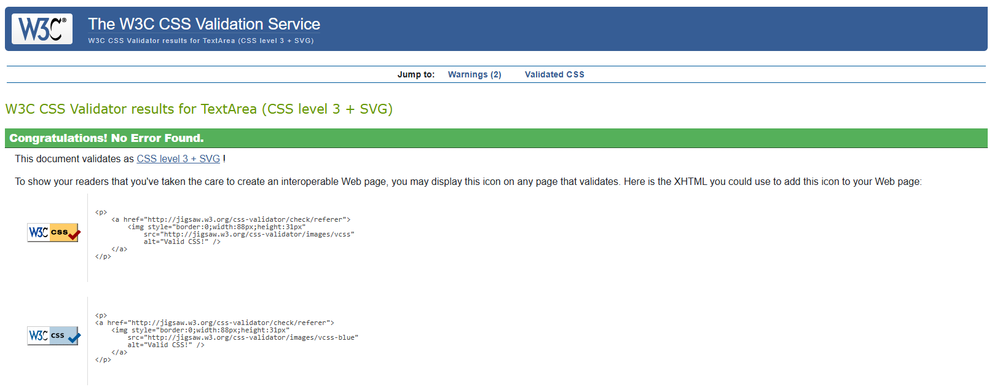
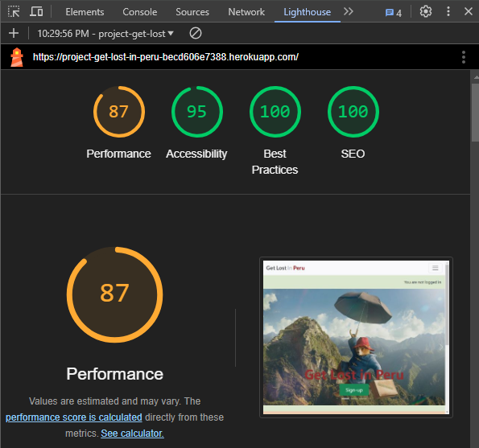
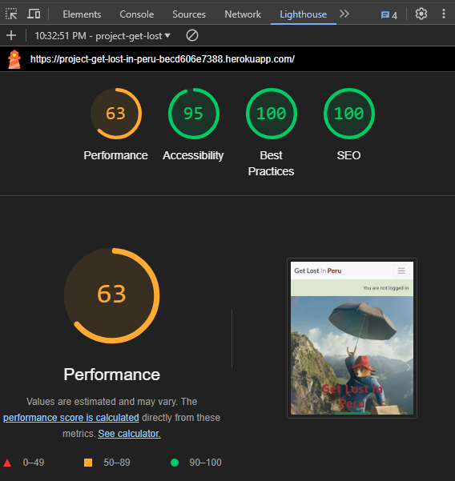
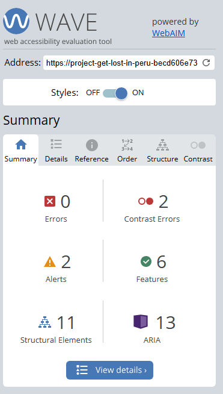
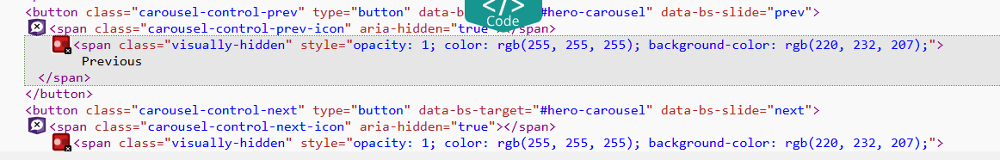
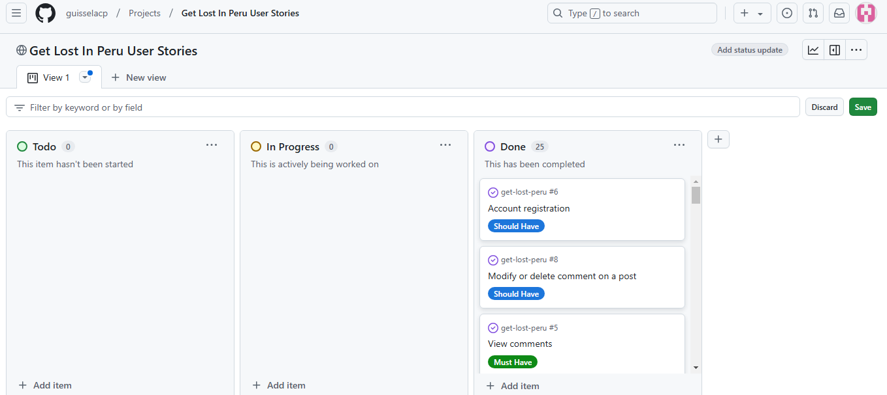

# Testing

This is the TESTING file for the [GetLostInPeru](https://project-get-lost-in-peru-becd606e7388.herokuapp.com/) website.

Return back to the [README.md](README.md) file.

## Testing Contents  
  
- [Testing](#testing)
  - [Testing Contents](#testing-contents)
  - [Validation](#validation)
    - [HTML Validation](#html-validation)
    - [JavaScript Validation](#javascript-validation)
    - [Python Validation](#python-validation)
    - [CSS Validation](#css-validation)
    - [Lighthouse Scores](#lighthouse-scores)
    - [Wave Accessibility Evaluation](#wave-accessibility-evaluation)
  - [Manual Testing](#manual-testing)
    - [Browser Compatibility](#browser-compatibility)
    - [Testing User Stories](#testing-user-stories)
    - [Dev Tools/Real World Device Testing](#dev-toolsreal-world-device-testing)
  - [Bugs](#bugs)
    

## Validation

### HTML Validation

For my HTML files I have used [HTML W3C Validator](https://validator.w3.org) to validate all of my HTML files.

I have had to follow a different approach for validating my HTML for this project as the majority of my pages are developed using Jinja syntax such as '' and '{{ form|crispy }}' and most require user authentication. The HTML validator will throw errors if I were to use my website's URL, so I have had to follow the below approach for every page:

- Via the deployed Heroku app link, I have navigated to each individual page.
- Right clicking on the screen/CTRL+U/⌘+U on Mac, allows a menu to appear, giving me the option to 'View page source'.
- The complete HTML code for the deployed page will appear, allowing you to select the entire code using CTRL+A/⌘+A on Mac.
- Paste the copied code into the [validate by input](https://validator.w3.org/#validate_by_input) option.
- Check for errors and warnings, fix any issues, revalidate by following the above steps and record the results.

All HTML pages were validated and received a 'No errors or warning to show' result, as shown above.

| HTML Source Code/Page | Errors | Warnings |
| ---- | ------ | -------- | 
| Home | 0 | 0 |
| Sign In | 0 | 0 |
| Sign Up | 0 | 0 |
| Posts | 0 | 0 |
| Add Post | 0 | 0 |
| Post_detail | 0 | 0 |
| Edit Post | 0 | 0 |
| Delete Post | 0 | 0 |
| Delete Comment | 0 | 0 |
| About | 0 | 0 |
| My_Posts | 0 | 0 |
|

| Error 403 | 0 | 0 |
| Error 404 | 0 | 0 |
| Error 500 | 0  | 0 |
  

  

### JavaScript Validation

I don't have any JavaScript code added to the project.

### Python Validation

[CI Python Linter](https://pep8ci.herokuapp.com/#) was used to validate the Python files that were created or edited by myself. No issues presented and line lengths were double checked. I have included some screenshots with the results below.

| Feature | admin.py | forms.py | models.py | urls.py | views.py |
|---------|----------|----------|-----------|---------|----------|
| Blog | [no errors](documentation/testing/blog_admin.png) | [no errors](documentation/testing/blog_forms.png) | [no errors](documentation/testing/blog_models.png) | [no errors](documentation/testing/blog_urls.png) | [no errors](documentation/testing/blog_views.png) |
| About  | [no errors](documentation/testing/about_admin.png) | [no errors](documentation/testing/about_forms.png) | [no errors](documentation/testing/about_models.png) | [no errors](documentation/testing/about_urls.png) | [no errors](documentation/testing/about_views.png) |
| GetLostInPeru main app | na | na | na | [no errors](documentation/testing/getlostinperu_urls.png) | na |
| Mainpage | na | na | na | [no errors](documentation/testing/mainpage_urls.png) | [no errors](documentation/testing/mainpage_views.png) |
| Userprofile | na | na | na | [no errors](documentation/testing/userprofile_urls.png) | [no errors](documentation/testing/userprofile_views.png) |

### CSS Validation 

[W3C CSS Validator](https://jigsaw.w3.org/css-validator/) was used to validate my CSS file.

 
   
### Lighthouse Scores

Lighthouse testing was carried out in Incognito mode to achieve the best result.

**Desktop and Mobile**  

  
*Desktop Home Page*  

 
*Mobile Home Page*    

  

### Wave Accessibility Evaluation

I should point out that the two contrast errors are due to the use of the carousel with Bootstrap.

## Manual Testing

### Browser Compatibility

GetLostInPeru was tested and the CRUD functionalities could be performed correctly on the following browsers:

- Chrome v114.0.5735.199
- Firefox v114.0.2
- Edge v114.0.1823.79

### Testing User Stories

The 25 proposed Users Stories were carried out and these were tested before being declared done.

## Bugs  
Being part of the Full Stack Project, although it was pretty challenging due to the time for project deliveries, there were difficult moments. It is worth noting that I could always find the assistance of Tutor Support, which guided me correctly.

Among the problems I had during the project, I could mention the following:

- Heroku Application Error
- Commit push failure
- Terminal rebase error
- Posts without slug field (I used slugify)
- Deployment with Heroku did not reflect the changes in my style.css